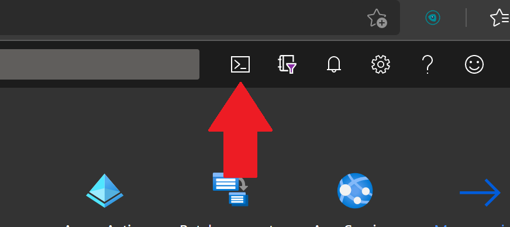
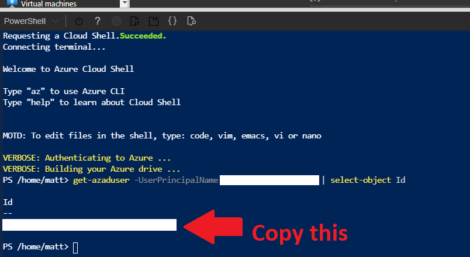
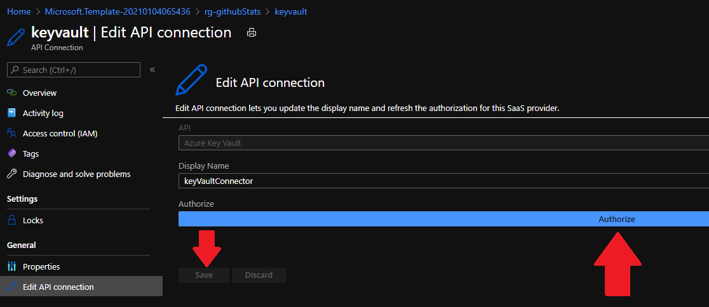
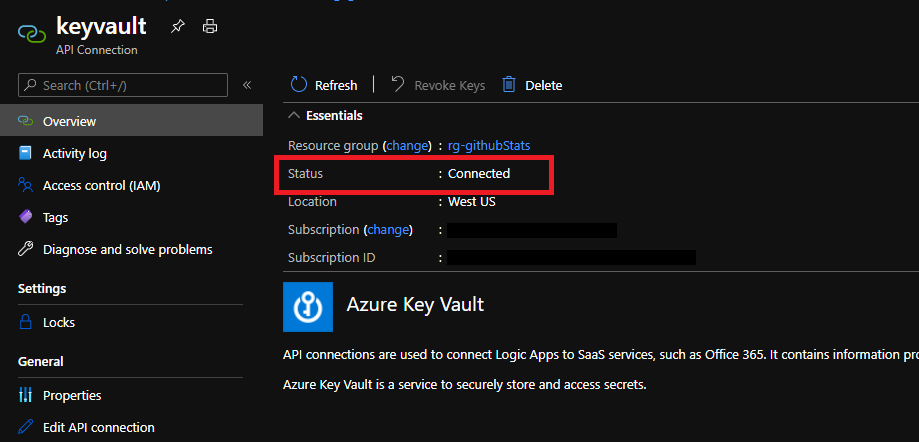
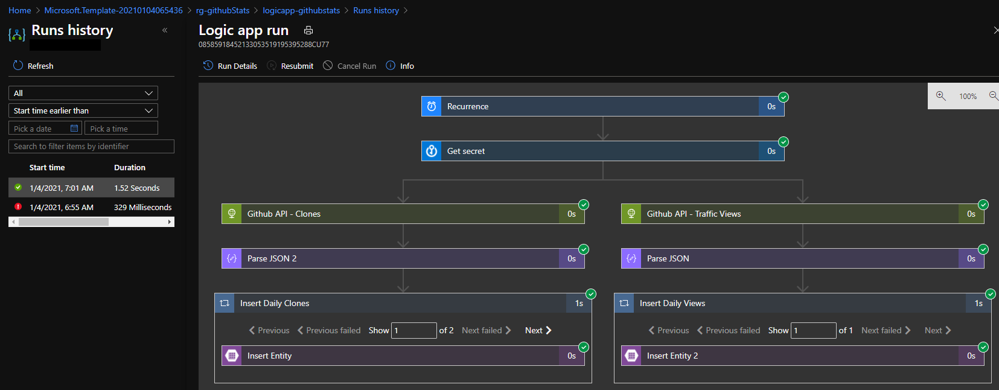
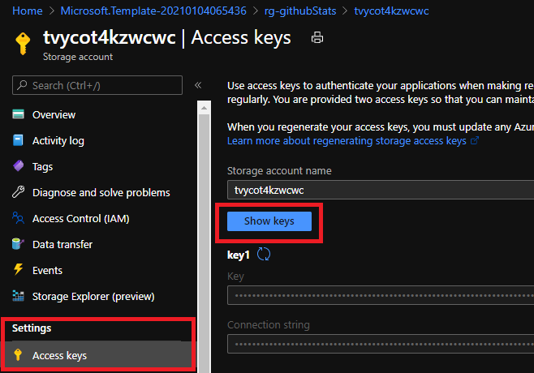
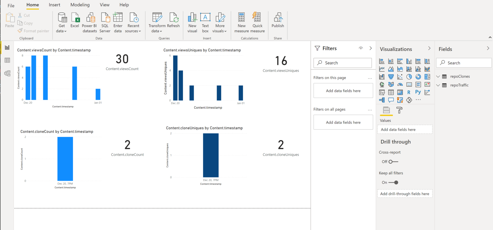

# Azure Logic App: Long-Term Github Stats

Github only tracks 14 days worth of traffic data for each repository. There are a few other projects out there that use different langauges to pull the data locally, but I wanted to run this serverless in Azure which is why I created this solution to run in [Azure Logic Apps](https://docs.microsoft.com/en-us/azure/logic-apps/logic-apps-overview).

This ARM template will deploy the following: 

- Resource Group
- Key Vault (to store your Github Personal Access Token as a Secret)
- Storage Account (to store your Github stats as Table Storage)
- Logic App 

The Logic App is triggered daily, and pulls the PAT from the key vault, queries the Github API, parses the JSON, and stores it in Table Storage. 

After the data is loaded into Table Storage you can do whatever you'd like with it, though i've included a basic PowerBI template to visualize the data using PowerBI desktop.

**This solution should cost less than $0.05/month.*


## How to deploy: 

### Deployment Video Walkthrough:

<a href="https://www.youtube.com/watch?v=PQJPugVOdQw">  </a>

For a video walkthrough, [click here](https://www.youtube.com/watch?v=PQJPugVOdQw). 

### Step-by-Step Deployment:

- **Step 1**: 
  - You will need a Github Personal Access Token, you can view the Github docs on that here: https://docs.github.com/en/free-pro-team@latest/github/authenticating-to-github/creating-a-personal-access-token
- **Step 2**:
  - Click the Deploy to Azure button below.

[//]: # (The short URLs below are to show impact of this solution by tracking number of deployments. You can use the direct link if you wish - https://portal.azure.com/#create/Microsoft.Template/uri/https%3A%2F%2Fraw.githubusercontent.com%2FMattHansen0%2Flogicapp-githubstats%2Fmain%2Fazuredeploy.json)


[](https://urls.hansencloud.com/deploy-githubstats-logicapp)  [](http://armviz.io/#/?load=https%3A%2F%2Fraw.githubusercontent.com%2FMattHansen0%2Flogicapp-githubstats%2Fmain%2Fazuredeploy.json)

- **Step 3**:
  - In the Azure Portal, open a PowerShell CloudShell, and run ```get-azaduser -UserPrincipalName yourUserName@company.com | select-object Id``` using the username with which you are logging into Azure (top right of the portal). Copy that Object ID,this is required for creating access policies in Key Vault and is an input parameter for deployment.







- **Step 4**:
  - Enter the parameter values on the deployment screen in the Azure Portal after you clicked "Deploy to Azure", and click deploy. 
- **Step 5**:
  - Once complete, you will need to open the API connection for keyvault, go to "Edit API" and click the blue bar that says "Authorize". You'll be presented with a pop-up sign-in box for a one-time authentication to link the connector to KeyVault. Click save after you're done. 






- **Step 6**:
  - Open the Logic App, and click "Run Trigger" (the first run will have failed becuase the connector wasn't authorized so you'll see that in the run history).




- **Step 7**:
  - You can verify the data by going to the storage account and viewing the table storage using Storage Explorer. 
- **Step 8**:
  - Open the PowerBI template using [PowerBI Desktop](https://powerbi.microsoft.com/en-us/downloads/), enter your storage account name and account key (account keys tab on the storage account in the portal) and your data should show up on the dashboard. 






This Logic App will run every day now to collect the stats for that repo and update the storage account with anything new. You now have the data in raw form and loaded into PowerBI and can do anything you'd like with it. 

## Contributing: 

PRs and issues welcome! 
